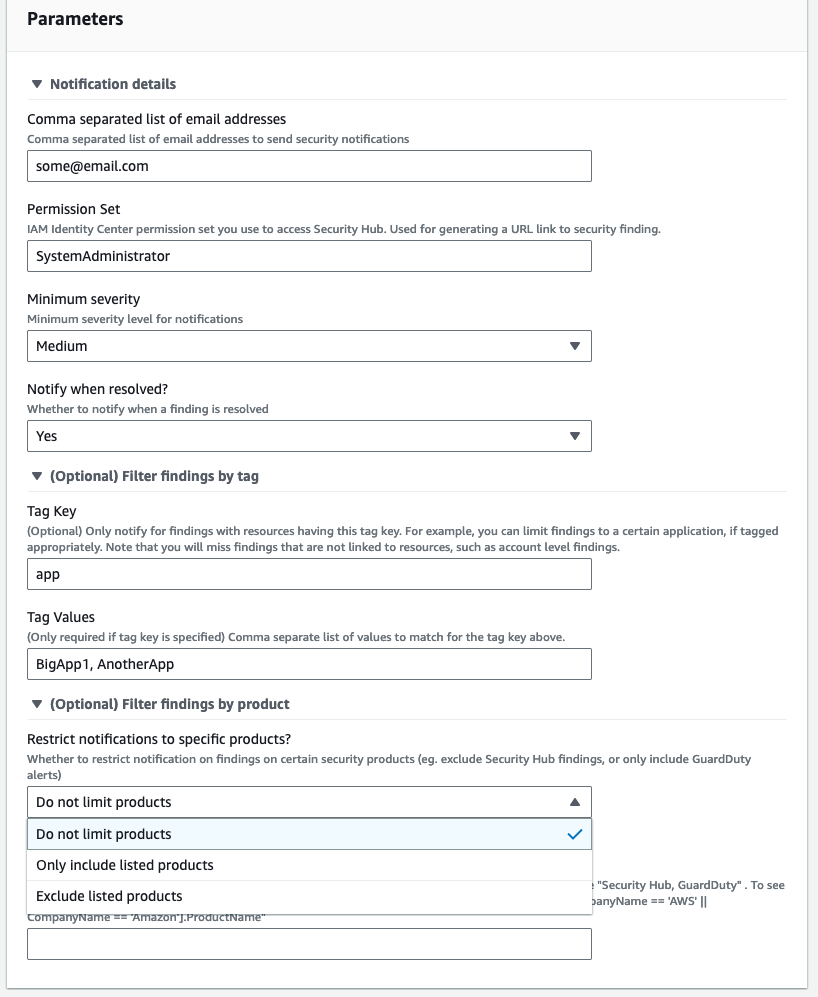
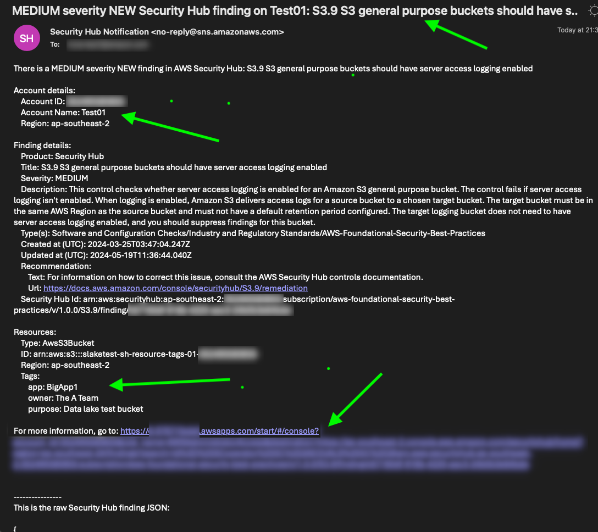
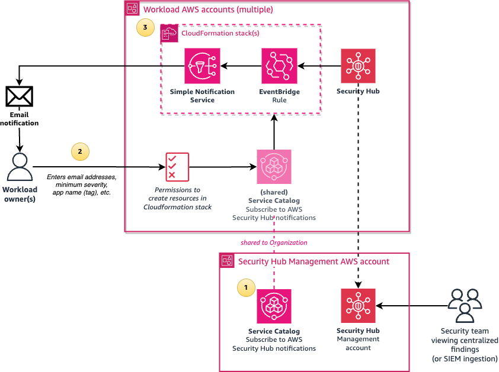
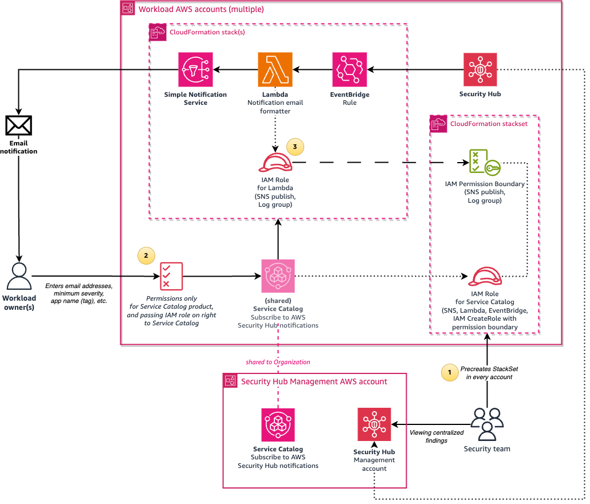

# Improving security incident response times by decentralizing security notifications using AWS Service Catalog

_If you are just after a CloudFormation template for receiving near real time Security Hub findings via email, and do not need self-service capabilities, just download the [Security Hub Notifications CloudFormation template](02_Service_Catalog/02_ServiceCatalog_Product/SecurityHub-Notifications.yaml) in this repo, edit the Mappings variables based on your environment, and deploy the stack_

This solution sets up a self-service [AWS Service Catalog](https://aws.amazon.com/servicecatalog/) based mechanism that allows workload owners to easily subscribe to near real-time email notifications of all security findings coming from their AWS accounts, or only findings relating to the specific workloads they own, based on tags. This is done by workload owners simply going to AWS Service Catalog, launching a Subscribe to AWS Security Hub notifications product, where they can enter details of the notifications they want to receive.



This is an example of a notification email:




## Architecture

The solution has a customizable deployment model, with two major architecture decision points that needs to be made before deployment:

1.	**Decision point 1 - No-Lambda or Lambda for formatting:** Either using native EventBridge mechanisms to format messages for readability, or using AWS Lambda. If you aren't sure, use the Lambda option. The Lambda option has additional features, defined in the table below. However, it requires IAM roles to be created for Lambda to use, and potentially requires maintenance if the Python runtime version in use becomes deprecated at some point in the future. Native EventBridge formatting does not require the creation IAM roles and does not create any Lambda functions.


| Feature                             | No-Lambda | Lambda |
|-------------------------------------|-----------|--------|
| Formats the security information    |    Yes    |  Yes   |
| Has summary in email subject        |    No     |  Yes   |
| Option to only show new findings[1] |    No     |  Yes   |
| Timezone conversion in emails       |    No     |  Yes   |
| IAM Identity Center link in email[2]|    No     |  Yes   |
| Works without creating IAM Roles    |    Yes    |  No[3] |


[1] When enabling Security Hub standards, Security Hub refreshes its control checks [every 12-24 hours](https://docs.aws.amazon.com/securityhub/latest/userguide/securityhub-standards-schedule.html), so with the No-Lambda version, you will be getting multiple alerts every few hours on non-compliance on controls until they are resolved. The Lambda version has an option (turned on by default) to only send alerts on new non-compliance findings, rather than sending repeated alerts for all existing non-complaint findings, to reduce alert noise. 

[2] [AWS IAM Identity Center](https://aws.amazon.com/iam/identity-center/) integration is optional. If you use federated IAM roles instead, those would work as well. IAM users are not supported out of the box.

[3] The Lambda version requires IAM roles to be created. To avoid requiring users that want to subscribe to securit notifications to have permissions to create IAM roles, a StackSet is included to deploy a least privilege Service Catalog launch role and permission boundary, along with an example IAM Identity Center permission set. 

2. **Decision point 2 - Use users permissions, or use launch role:**: Either using the calling user’s IAM permissions to create the product resources such as SNS topics, or using a launch IAM role and a permission boundary that is deployed in every AWS account in advance. The latter allows granting users minimal permissions to launch the product. 


With the simplest deployment option of using native EventBridge formatting and using the calling user’s IAM permissions, the solution involves the following components:



1.	A central Subscribe to AWS Security Hub notifications Service Catalog product is created in an AWS account, which is shared with the entire AWS Organization or specific Organizational Units (OUs). The product is configured with the names of IAM roles or IAM Identity Center permission sets that can launch the product.

2.	Users logging in via the designated IAM roles or permission sets accesses the shared Service Catalog product from the AWS Management Console, and enters the required parameters such as their email address and the minimum severity level for notifications.

3.	The Service Catalog product creates an AWS CloudFormation stack, which creates an SNS topic and an EventBridge rule that filters new Security Hub finding events matching the user’s parameters, such as minimum severity level. The rule then formats the JSON message to make it human readable using native [EventBridge Input Transformers](https://docs.aws.amazon.com/eventbridge/latest/userguide/eb-transform-target-input.html), and the formatted message is sent to SNS, which emails the user.


An alternative but recommended deployment option, involving Lambda for formatting messages and associating the Service Catalog product with a launch IAM role, is similar to the previous option but with the following changes:



1.	A CloudFormation [StackSet](https://docs.aws.amazon.com/AWSCloudFormation/latest/UserGuide/what-is-cfnstacksets.html) is created in advance to pre-create an IAM role and an IAM permission boundary policy in every AWS account. The IAM role is used by the Service Catalog product, and has permissions to create the CloudFormation resources such as SNS topics, as well as create IAM Roles that are restricted by the IAM permission boundary that only allows publishing SNS messages and writing to Amazon CloudWatch Logs.

2.	Users wanting to subscribe to security notifications only require minimal permissions: just enough to access Service Catalog, and [pass](https://docs.aws.amazon.com/IAM/latest/UserGuide/id_roles_use_passrole.html) the above pre-created role to Service Catalog. A sample AWS Identity Center permission set is provided with the solution with these minimal permissions.

3.	The product uses a Lambda function to format the message to make it human readable, and has additional logic to include a direct link via IAM Identity Center to the finding, as well as avoiding repeated notifications for the same finding ID. An IAM role, limited by the permission boundary, is created by the stack, which is assumed by the Lambda function to publish the SNS message.


# Pre-requisites

The solution installation setup requires:

1.	Administrator level access to AWS Organizations. AWS Organizations needs to have [All Features](https://docs.aws.amazon.com/organizations/latest/userguide/orgs_manage_org_support-all-features.html) enabled.
2.	AWS Security Hub enabled across all accounts.
3.	An AWS account to host this solution, for example the Security Hub administrator account, or a shared services account. This cannot be the management account.
4.	One or more AWS accounts to consume the Service Catalog product.
5.	Authentication using [AWS IAM Identity Center](https://aws.amazon.com/iam/identity-center/) or federated IAM role names in every AWS account for users accessing the Service Catalog product.
6.	(Only required when opting to use Service Catalog launch roles) CloudFormation StackSet creation access to either the management account or a [CloudFormation delegated administrator account](https://docs.aws.amazon.com/AWSCloudFormation/latest/UserGuide/stacksets-orgs-delegated-admin.html).


## Installation

There are four steps to deploy this solution:

1.	AWS Organizations configuration to allow Service Catalog product sharing.
2.	(Optional, recommended) Using CloudFormation StackSets to deploy the Service Catalog launch IAM role across accounts.
3.	Service Catalog product creation to allow users to subscribe to Security Hub notifications.
4.	(Optional, recommended) Provision least privileged IAM Identity Center permission sets. 


### Step 1 – AWS Organizations configuration

Service Catalog Organizations sharing needs to be enabled and the account hosting the solution needs to be one of the delegated administrators for Service Catalog. This allows sharing the Service Catalog product to other AWS accounts in the Organization.

To enable this, log into the AWS Management Console of the management AWS account, launch the AWS CloudShell service and type the following commands. Replace the solution_account_id variable with the ID of the account that will host the Service Catalog product:

```bash
# Set a variable with the ID of the account that will host the solution
solution_account_id=012345678910

# Enable AWS Organizations integration in Service Catalog
aws servicecatalog enable-aws-organizations-access

# Nominate the account to be one of the delegated administrators for Service Catalog
aws organizations register-delegated-administrator --account-id $solution_account_id --service-principal servicecatalog.amazonaws.com
```


### Step 2 – (Optional, recommended) Deploy IAM roles across accounts with CloudFormation StackSets

The following steps creates a CloudFormation StackSet to deploy a Service Catalog launch IAM role and permission boundary across all accounts. This is highly recommended if you will be enabling Lambda formatting, because if you skip this step, only users with IAM CreateRole permissions would be able to subscribe to security notifications, effectively limiting it to those with Administrator level access to the account.

If you just want to test the template in an account before deploying this across all accounts, or you have your own mechanism for deploying a CloudFormation template to all accounts or specific OUs, use the CloudFormation template [here](01_IAM/SecurityHub_notifications_IAM_role.yaml).

Otherwise, log into the AWS Management Console of the management AWS account, or a [CloudFormation StackSet delegated administrator account](https://docs.aws.amazon.com/AWSCloudFormation/latest/UserGuide/stacksets-orgs-delegated-admin.html), and then:

1.	Download the CloudFormation template, [SecurityHub_notifications_IAM_role_stackset.yaml](01_IAM/SecurityHub_notifications_IAM_role_stackset.yaml), for creating the StackSet.
2.	Navigate to the AWS CloudFormation page.
3.	Click on Create stack -> With new resources (standard).
4.	Select Upload a template file and upload the CloudFormation template downloaded earlier: SecurityHub_notifications_IAM_role_stackset.yaml and click Next.
5.	Enter the stack name **SecurityNotifications-IAM-roles-StackSet**
6.	Enter the values for the parameters:
- - **AWS Organization ID**: Start AWS CloudShell and enter the command in the description to get the organization ID.
- - **Organization root ID or OU ID(s)**: To deploy the IAM role and permission boundary to every account, enter the organization root ID using CloudShell and the command in the description. To deploy it to specific OUs, enter a comma separated list of OU IDs. Ensure that you include the OU of the account hosting the solution.
- - **Current Account Type**: Either Management account or Delegated administrator account, as needed.
- - **Formatting method**: Whether you plan to use the Lambda formatter for Security Hub notifications, or native EventBridge formatting with no Lambda functions. If unsure, use Lambda.
7.	Click Next, then optionally enter tags and click Next again. Wait for the stack creation to finish.


### Step 3: Set up Service Catalog product

If you skipped the above step, note that all users that want to subscribe to security notifications using Service Catalog would need permissions to create SNS, EventBridge and (for the Lambda version) IAM roles, CloudWatch Log groups and Lambda functions. 

Run an included installation script that creates the CloudFormation templates required to deploy the Service Catalog product and portfolio.

To run the script, log into the console of the AWS account and region that will be hosting the solution, and start the AWS CloudShell service. In the terminal, enter the following commands:

```bash
git clone https://github.com/aws-samples/improving-security-response-by-decentralizing-security-notifications.git
cd improving-security-response-by-decentralizing-security-notifications
./install.sh
```

The script will ask for the following information:
- Whether you will be using the **Lambda formatter** (as opposed to the native EventBridge formatter).
- The [timezone](https://en.wikipedia.org/wiki/List_of_tz_database_time_zones) used for displaying dates and times in the email notifications, for example Australia/Melbourne. This defaults to UTC.
- The Service Catalog **provider display name**, which can be your company, organization or team name. 
- The Service Catalog **product version**, which defaults to v1. Increment this if you make a change in the product CloudFormation template file.
- Whether you deployed the **IAM role StackSet** in Step 2 earlier.
- The **principal type** that will be using the Service Catalog product. If you are using AWS IAM Identity Center, enter: IAM_Identity_Center_Permission_Set . If you have federated IAM roles configured, select: IAM_role_name .
- If you selected IAM_Identity_Center_Permission_Set in the previous step, enter the **IAM Identity Center URL subdomain**. This is used for creating a shortcut URL link to Security Hub in the email. For example, if your URL looks like this https://d-abcd1234.awsapps.com/start/#/, then enter d-abcd1234.
- The **principal(s)** that will have access to the Service Catalog product across the AWS accounts. 
If you are using IAM Identity Center, this will be a permission set name. If you will be deploying the provided permission set in the next step (Step 4), press enter to accept the default of SubscribeToSecurityNotifications. Otherwise, enter an appropriate permission set name (for example AWSPowerUserAccess) or IAM role name that users use.

The script creates the following CloudFormation stacks:
- [SecurityHub_notifications_SC-Bucket.yaml](02_Service_Catalog/01_Bucket/SecurityHub_notifications_SC-Bucket.yaml): creates an Amazon Simple Storage (Amazon S3) bucket that contains the file [SecurityHub-Notifications.yaml](02_Service_Catalog/02_ServiceCatalog_Product/SecurityHub-Notifications.yaml), which is the CloudFormation template file associated with the Service Catalog product. The script modifies the Mappings section of the template file that has the configuration details depending on the answers to the installation script questions, before uploading it to the bucket.
- [SecurityHub_notifications_ServiceCatalog_Portfolio.yaml](02_Service_Catalog/03_ServiceCatalog_Portfolio/SecurityHub_notifications_ServiceCatalog_Portfolio.yaml): creates a Service Catalog portfolio and product using the Amazon S3 bucket from the previous step and gives permissions to the required principals to launch the product.

After the script finishes the installation, it outputs the Service Catalog Product ID which will be needed in the next step. It then asks whether it should automatically share this Service Catalog portfolio with the entire Organization, a specific account, or whether you will configure sharing to specific OUs manually. 

To manually configuring sharing with an OU, go to Service Catalog -> Portfolios, select Subscribe to AWS Security Hub notifications, in the Share tab click add a share, select AWS Organization, and select the OU. The product will be shared to all accounts and child OUs within the selected OU. Ensure that you select Principal Sharing, click Share.


### Step 4 – (Optional, recommended) Provision IAM Identity Center permission sets

This step requires you to have completed Step 2 (Deploy IAM roles across accounts with CloudFormation StackSets).

If you are using IAM Identity Center, the following steps creates a custom permission set, SubscribeToSecurityNotifications, that provides least privileged access for users to subscribe to security notifications. The permission set redirects to the Service Catalog page to launch the product. 

Log into the AWS Management Console of the management AWS account, or an [IAM Identity Center delegated administrator account](https://docs.aws.amazon.com/singlesignon/latest/userguide/delegated-admin.html), and then:

1. Download the CloudFormation template, [SecurityHub_notifications_PermissionSets.yaml](03_IAM_Identity_Center_PermissionSets/SecurityHub_notifications_PermissionSets.yaml), for creating the permission set.
2. Navigate to the AWS CloudFormation page.
3. Click on Create stack -> With new resources (standard).
4. Select Upload a template file and upload the CloudFormation template downloaded earlier: SecurityHub_notifications_PermissionSets.yaml and click Next.
5. Enter a stack name: SecurityNotifications-PermissionSet
6. Enter the values for the parameters:
- - **AWS IAM Identity Center Instance ARN**: Use the AWS CloudShell command in the description to get the IAM Identity Center ARN.
- - **Permission set name**: Use the default of SubscribeToSecurityNotifications
- - **Service Catalog product ID**: Use the last output line of the install.sh script in Step 3, or alternatively get the product ID from the Service Catalog console of the product account. 
7. Click Next, then optionally enter tags and click Next again. Wait for the stack creation to finish.
Using the IAM Identity Center console, select your AWS accounts, and assign access to your users or groups to the SubscribeToSecurityNotifications permission set. 


## Testing

Finally, log into any AWS account, ensuring you are logged in with the designated IAM Identity Center Permission Set or IAM role. Launch the product in Service Catalog to subscribe to AWS Security Hub security notifications. 

Wait for a Security Hub notification. For example, if you have the [AWS Foundational Security Best Practices (FSBP)](https://docs.aws.amazon.com/securityhub/latest/userguide/fsbp-standard.html) standard enabled, creating an S3 bucket with no server access logging enabled should generate a notification within a few minutes.


## Additional notes

- There is a [cost for each SNS email notification](https://aws.amazon.com/sns/pricing) sent out as well as [Service Catalog API calls](https://aws.amazon.com/servicecatalog/pricing/) and [Lambda execution costs](https://aws.amazon.com/lambda/pricing/) (if enabled).

- To expand this solution across regions, enable Security Hub [cross-Region aggregation](https://docs.aws.amazon.com/securityhub/latest/userguide/finding-aggregation.html). This would result in the email notifications coming from all the regions configured in Security Hub, even though the Service Catalog product is instantiated in a single region.

- Consider enabling Security Hub [Consolidated control findings](https://docs.aws.amazon.com/securityhub/latest/userguide/controls-findings-create-update.html#consolidated-control-findings) to avoid receiving multiple email notifications for the same control that applies to multiple standards.

-	The blog post [“Considerations for security operations in the cloud”](https://aws.amazon.com/blogs/security/considerations-for-security-operations-in-the-cloud/) goes through more information into comparing and contrasting centralized, decentralized and hybrid models for security operations. 

-	The [“Implement actionable security events”](https://docs.aws.amazon.com/wellarchitected/latest/security-pillar/sec_detect_investigate_events_actionable_events.html) and [“Incident response”] (https://docs.aws.amazon.com/wellarchitected/latest/security-pillar/incident-response.html) sections of the [Security Pillar](https://docs.aws.amazon.com/wellarchitected/latest/security-pillar/welcome.html) of the [AWS Well-Architected Framework](https://aws.amazon.com/architecture/well-architected/) goes through best practices around alerting and incident response. 


## Cleanup

To remove the solution, follow these steps:

- In the workload account(s) where the product was launched:
- - Go to Service Catalog provisioned products and terminate the associated provisioned product(s). This stops security notifications from being sent to the email address associated with the product.
- In the AWS account hosting the directory:
- - Go to Service Catalog, portfolios, click on **Subscribe to AWS Security Hub notifications**, go to the Share tab, select the items in the list and click on Actions -> Unshare.
- - Go to CloudFormation, delete the **SecurityNotifications-Service-Catalog** stack. 
- - Go to Amazon S3, and for the two buckets starting with **securitynotifications-sc-bucket**, select the bucket, click on Empty and empty the bucket.
- - Go to CloudFormation, delete the **SecurityNotifications-SC-Bucket** stack. 
- If applicable, go to the management account or the CloudFormation delegated administrator account, and delete the **SecurityNotifications-IAM-roles-StackSet** stack.
- If applicable, go to the management account or the IAM Identity Center delegated administrator account, and delete the **SecurityNotifications-PermissionSet** stack.


## License

This library is licensed under the MIT-0 License. See the LICENSE file.


